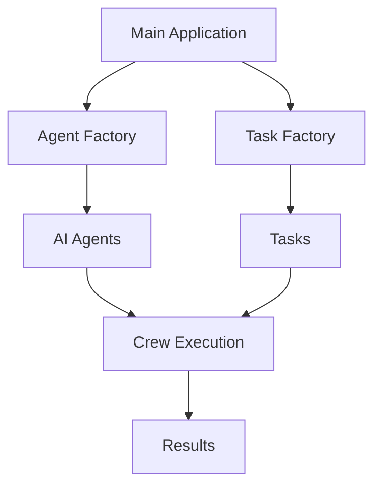

# Architecture Overview

## System Components

### 1. Agent System
The agent system is built around three key roles:

```python
Tech Lead -> Developer -> Code Reviewer
```

Each agent has specific responsibilities and capabilities:

- **Tech Lead**: Strategic decision-making and architecture
- **Developer**: Implementation and problem-solving
- **Code Reviewer**: Quality assurance and best practices

### 2. Task Management

Tasks follow a structured workflow:
```
Create Task -> Assign Agent -> Execute -> Review -> Complete
```

### 3. Environment Management

The environment system handles:
- Configuration loading
- API key management
- Error handling
- Resource validation

## Design Patterns

1. **Factory Pattern**
   - `AgentFactory`: Creates specialized AI agents
   - `TaskFactory`: Generates task instances

2. **Singleton Pattern**
   - Used for environment configuration
   - Ensures consistent state

3. **Observer Pattern**
   - Monitors task execution
   - Provides progress updates

## Data Flow



## Security Considerations

1. API Key Management
   - Keys stored in `.env` file
   - Not committed to version control
   - Validated at startup

2. Input Validation
   - All agent inputs are validated
   - Task parameters are checked
   - Error handling for invalid inputs

## Extensibility

The system is designed for easy extension:

1. Adding New Agents
   - Create new agent class
   - Add to AgentFactory
   - Define role and capabilities

2. Creating Custom Tasks
   - Implement new task types
   - Add to TaskFactory
   - Define workflow integration

3. Adding Features
   - Follow modular design
   - Use existing patterns
   - Maintain documentation
